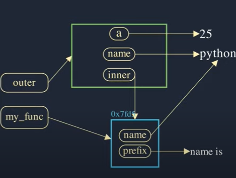
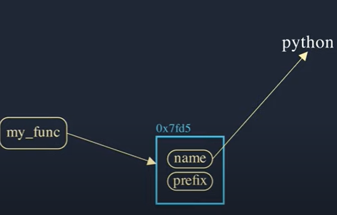

# **Python Basic**

## **1. Data types**

### **1.1. Scalar types**

#### **1.1.1. Number**

- **int**: số nguyên
- **float**: số thực
- **complex**: số phức

#### **1.1.2. String**

- String trong python là một chuỗi các ký tự, được đặt trong cặp dấu nháy đơn hoặc nháy kép.
- Chuỗi trong python là một đối tượng immutable.
- Các phép toán trên chuỗi:
  - **+**: nối chuỗi
  - **in**: kiểm tra xem một chuỗi có nằm trong chuỗi khác hay không
  - **not in**: kiểm tra xem một chuỗi có không nằm trong chuỗi khác hay không
  - **[]**: truy xuất phần tử trong chuỗi
  - **[:]**: cắt chuỗi
  - **len()**: độ dài của chuỗi

#### **1.1.3. Boolean**

- **Falsy values**:
  - Empty lists `[]`
  - Empty tuples `()`
  - Empty dictionaries `{}`
  - Empty sets `set()`
  - Empty strings `""`
  - Empty ranges `range(0)`
  - Integer: `0`
  - Float: `0.0`
  - Complex: `0j`
  - `None`
  - `False`
- **True**: còn lại

### **1.2. Compound type**

#### **1.2.1. List, Tuple, Set, Dictionary**

| Kiểu dữ liệu| List |Tuple | Set | Dict|
|:--|:--|:--|:--|:--|
|Ví dụ|[1, 2, 3, 4, 5]|(1, 2, 3, 4, 5)|{1, 2, 3, 4, 5}|{1: "a", 2: "b", 3: "c", 4: "d", 5: "e"}|
|Tạo|list()|tuple()|set()|dict()|
|Mutable|Mutable|Immutable|Mutable|Mutable|
|Sắp xếp|Có thể|Có thể|Không thể|Có thể|
|Trùng lặp|Có thể|Có thể|Không thể|Không thể trùng key|
|Tạo rỗng|emptyList =[]| emptyTuple = ()|a = set()  b = set(a)| emptyDict = {}|

- List methods:
  - **append(item)**: thêm item vào cuối list
  - **extend(iterable)**: thêm các phần tử của iterable vào cuối list
  - **insert(index, item)**: thêm item vào vị trí index

  - **remove(item)**: xóa item đầu tiên trong list
  - **pop(index)**: xóa phần tử tại vị trí index và trả về phần tử đó
  - **clear()**: xóa tất cả các phần tử

  - **index(item)**: trả về vị trí đầu tiên của item trong list
  - **count(item)**: đếm số lần xuất hiện của item trong list
  - **sort()**: sắp xếp list
  - **reverse()**: return none, only reverse this list
  - **copy()**: tạo một bản sao của list

- Tuple methods:
  - **count(item)**: count the number of times item appears in tuple
  - **index(item)**: return the index of the first item that is equal to item

- Set methods:
  - **clear()**: remove all elements in set
  - **copy()**: return a copy of set
  - **difference(set)**: return a set containing the difference between two or more sets

  - **add(item)**: add item to set
  - **update(iterable)**: update current set by adding items from iterable

  - **remove(item)**: delete item, but raise KeyError if item not found
  - **discard(item)**: delete item, but do not raise KeyError if item not found
  - **pop()**: remove and return a random item from set

  - **intersection(set)**: return a set containing the intersection (the same element) of two or more sets
  - **intersection_update(set)**: removes the items that is not present in both sets
  - **isdisjoint(set)**: return True if two sets have a null intersection (no same element)
  - **issubset(set)**: return True if another set contains this set
  - **issuperset(set)**: return True if this set contains another set
  - **difference(set)**: return a set containing the difference between two or more sets
  - **difference_update(set)**: removes the items that is present in both sets
  - **symmetric_difference(set)**: return a set with the symmetric differences of two sets (the items that is not present in both sets)
  - **symmetric_difference_update(set)**: updates the original set by removing items that are present in both sets, and inserting the other items.
  - **union(set)**: return a set containing the union of sets

- Dictionary methods:
  - **clear()**: xóa tất cả các phần tử
  - **copy()**: tạo một bản sao của dictionary

  - **keys()**: trả về danh sách các key
  - **values()**: trả về danh sách các value
  - **items()**: trả về danh sách các cặp key-value

  - **get(key)**: trả về value của key
  - **pop(key)**: xóa key và trả về value của key

  - **popitem()**: xóa phần tử cuối cùng và trả về cặp key-value
  - **update(dict)**: cập nhật dictionary với các cặp key-value của dict

  - **setdefault(key, value)**: returns the value of the item with the specified key. If the key does not exist, insert the key, with the specified value

  - **dict.fromkeys(key, value)**: returns a dictionary with the specified keys and the specified value.

### **1.3. None**

- None là một giá trị đặc biệt có thể coi như là một giá trị rỗng hoặc null.
  - Nó được sử dụng làm giá trị khởi tạo mặc định cho biến.
  - Kiểm tra None bằng cách sử dụng if var is None
  - Không thể chuyển đổi None thành một kiểu dữ liệu khác

```python
var = None
print(var is None) # True
print(var == None) # True
print(var != None) # False
```

## **2. Condition statement**

```python
if condition:
    statement
elif condition:
    statement
else:
    statement
```

## **3. Looping**

### **3.1. For loop**

```python
for i in range(10):
    print(i)
```

### **3.2. While loop**

```python
i = 0
while i < 10:
    print(i)
    i += 1
```

- Python không có **do while** loop

## **4. Function**

```python
def function_name(parameter1, parameter2, ...):
    statement
    return value
```

## **5. Class**

```python
class ClassName:
    def __init__(self, parameter1, parameter2, ...):
        self.parameter1 = parameter1
        self.parameter2 = parameter2
        ...
    def method1(self, parameter1, parameter2, ...):
        statement
        return value
    def method2(self, parameter1, parameter2, ...):
        statement
        return value
    ...
```

## **6. OOP**

### **6.1. Encapsulation - Đóng gói**

- **Encapsulation**:
  - Hide data and methods inside a class
  - Users only need to know how to use it, not how it works
- Encapsulation is implemented by using access modifiers

| Access modifier | Public | Protected | Private |
| --- | --- | --- | --- |
| From inside class | Yes | Yes | Yes |
| From outside class | Yes | No | No |
| From derived class | Yes | Yes | No |
| From getter/setter | Yes | Yes | Yes |

- Python does not support private members, so private members can still be accessed from outside the class.
- Convention:
  - private members prefixed with double underscore (__)
  - protected members are prefixed with single underscore (_).

```python
class Base:
    def __init__(self):
        self.public = "public"
        self._protected = "protected"
        self.__private = "private"
    def get_private(self):
        return self.__private
    def set_private(self, private):
        self.__private = private

base = Base()
print(base.public) # public
print(base._protected) # protected
print(base.__private) # error
print(base._Base__private) # private can be accessed through this way
```

### **6.2. Inheritance - Thừa kế**

- **Inheritance** is a mechanism in which one class acquires the property of another class.
- **Parent class** (or **super class**): the class being inherited from.
- **Child class** (or **sub class**): the class that inherits from another class.

```python
class Person:
    def __init__(self, name, age):
        self.name = name
        self.age = age
    def get_name(self):
        return self.name
    def get_age(self):
        return self.age
    def set_name(self, name):
        self.name = name
    def set_age(self, age):
        self.age = age

class Student(Person):
    def __init__(self, name, age, student_id):
        super().__init__(name, age)
        self.student_id = student_id
    def get_student_id(self):
        return self.student_id
    def set_student_id(self, student_id):
        self.student_id = student_id
```

### **6.3. Polymorphism - Đa hình**

- **Polymorphism** is the ability of an object to take on many forms.
- Two types of polymorphism in Python:
  - **Overloading**: same name but different parameters
  - **Overriding**: same name and same parameters, but one is in parent class and one is in child class

### **6.4. Abstraction**

- **Abstraction** is concentrating on the essential characteristics of an object rather than showing all the details.

```python
from abc import ABC, abstractmethod
class Polygon(ABC):
    @abstractmethod
    def noofsides(self):
        pass

class Triangle(Polygon):
    # overriding abstract method
    def noofsides(self):
        print("I have 3 sides")

class Pentagon(Polygon):
    # overriding abstract method
    def noofsides(self):
        print("I have 5 sides")

# Driver code
R = Triangle()
R.noofsides() # I have 3 sides

R = Pentagon()
R.noofsides() # I have 5 sides
```

## **7. Magic method**

|Initialization and Construction|Description|
|:--|:--|
|`__new__(cls, other)`| Dùng để tạo một instance mới của class.|
|`__init__(self, other)`| Được gọi bởi `__new__` method. Dùng để khởi tạo đối tượng|
|`__del__(self)`| Hàm hủy, được gọi khi đối tượng bị hủy.|

|Unary Operators|Description|
|:--|:--|
|`__pos__(self)`| positive (+)|
|`__neg__(self)`| negation (-)|
|`__abs__(self)`| abs() |
|`__invert__(self)`| ~ operator|
|`__round__(self, n)`|  round() |
|`__floor__(self)`|  math.floor()|
|`__ceil__(self)`| math.ceil()|
|`__int__(self)`| int() |
|`__float__(self)`| float()|
|`__complex__(self)`| complex() |
|`__oct__(self)`| oct() |
|`__hex__(self)`| hex() |

|Binary Operators|Description|
|:--|:--|
|`__add__(self, other)`| a + b|
|`__sub__(self, other)`| a - b|
|`__mul__(self, other)`| a*b |
|`__floordiv__(self, other)`| a//b |
|`__truediv__(self, other)`| a/b |
|`__mod__(self, other)`| a%b |
|`__pow__(self, other[, modulo])`| a**b |
|`__lshift__(self, other)`| a << b|
|`__rshift__(self, other)`| a >> b|
|`__and__(self, other)`| a&b |
|`__or__(self, other)`| a|b .|
|`__xor__(self, other)`| a^b |

|Extended Assignment Operators|Description|
|:--|:--|
|`__iadd__(self, other)`| a += b|
|`__isub__(self, other)`| -= |
|`__imul__(self, other)`| *= |
|`__ifloordiv__(self, other)`|  //= |
|`__idiv__(self, other)`|  /= |
|`__imod__(self, other)`| %= |
|`__ipow__(self, other[, modulo])`| **= |
|`__ilshift__(self, other)`| <<= |
|`__irshift__(self, other)`| >>= |
|`__iand__(self, other)`|  &= |
|`__ior__(self, other)`|  |= |
|`__ixor__(self, other)`|  ^= |

|Comparison Operators|Description|
|:--|:--|
|`__lt__(self, other)`|  < |
|`__le__(self, other)`|  <= |
|`__eq__(self, other)`| == |
|`__ne__(self, other)`|  != |
|`__gt__(self, other)`|  > |
|`__ge__(self, other)`|  >= |

|Container Methods|Description|
|:--|:--|
|`__len__(self)`| Implements behavior for the len() built in function.|
|`__getitem__(self, key)`|Implements behavior for indexing (e.g. self[key]).|
|`__setitem__(self, key, value)`|Implements behavior for assigning to indexed values (e.g. self[key] = value).|
|`__delitem__(self, key)`|Implements behavior for deleting indexed values (e.g. del self[key]).|
|`__iter__(self)`|Implements behavior for iteration over self (e.g. in for loops).|
|`__reversed__(self)`|Implements behavior for the reversed() built in function.|
|`__contains__(self, item)`|Implements behavior for membership tests using in and not in.|

|String Magic Methods|Description|
|:--|:--|
|`__str__(self)`|To implement the str() built in function and the print statement.|
|`__repr__(self)`|To implement the repr() built in function and the interactive interpreter.|
|`__unicode__(self)`|To implement unicode() built in function.|
|`__format__(self, formatstr)`|To implement behavior for the new format string protocol.|
|`__hash__(self)`|To implement behavior for when hash() is called on an object (for example, in set retrieval using obj in set).|
|`__nonzero__(self)`|To implement truth value testing and the built in operation bool(); should return False or True, depending on whether you think the object should be considered true or false respectively.|
|`__dir__(self)`|To implement behavior for the dir() built in function.|
|`__sizeof__(self)`|To implement behavior for the sys.getsizeof() method.|

## **8. Closure**

- Closure is happen when:
  - Have a nested function (inner function) inside another function (outer function)
    - The nested function (inner function) **must bound** to a variable of outer function
    - Outer function return nested function (inner function)
    - The variable of outer function is deleted after outer function executed, but the nested function still keep the value of variable of outer function

- Closure is a function plus an extended scope that contains the free variables

- Tác dụng của closure:
  - Ta có thể dùng closure để thay cho việc dùng class
  - Closure giúp che giấu các biến private hiệu quả hơn

```python
def outer():
    a = 25
    name = "python"
    def inner(prefix):
        print(prefix, name)
    return inner

func = outer()
func("name is") # name is python
```





- Giải thích:
  - Sau khi hàm outer() thực thi xong, biến a và name sẽ bị hủy, tuy nhiên giá trị của biến name được trỏ tới bởi biến name trong hàm inner(). Do đó giá trị "python" vẫn tồn tại.

```python
def counter(start):
    def inc(step = 1):
        nonlocal start
        start += step
        return start
    return inc

my_counter = counter(0)
print(my_counter()) # 1
print(my_counter()) # 2
print(my_counter(5)) # 7
print(my_counter()) # 8
```

## **9. Decorator**

- Decorator là một loại closure đặc biệt
- Decorator là một hàm nhận tham số đầu vào là một hàm khác và mở rộng tính năng cho hàm đó mà không thay đổi nội dung của nó.

```python
import time

def timer(func):
    def wrapper():
        t1 = time.time()
        func()
        t2 = time.time()
        print(f"Run time is {t2-t1}")
    return wrapper

@timer
def some_function():
    for i in range(5):
        time.sleep(1)
        print('Done!', i)

some_function()
'''
Done! 0
Done! 1
Done! 2
Done! 3
Done! 4
Run time is 5.041553735733032
'''
some_function.__name__ # wrapper

```

- Với cách trên sẽ ghi đè tên của hàm được wrap. Có thể sử dụng functools để giải quyết vấn đề này

```python
import time
from functools import wraps

def timer(func):
    @wraps(func)
    def wrapper():
        t1 = time.time()
        func()
        t2 = time.time()
        print(f"Run time is {t2-t1}")
    return wrapper

@timer
def some_function():
    for i in range(5):
        time.sleep(1)
        print('Done!', i)

some_function.__name__ # some_function
```

- Có thể ứng dụng để ghi log

```python
from functools import wraps

def logit(func):
    @wraps(func)
    def with_logging(*args, **kwargs):
        print(func.__name__ + " was called")
        return func(*args, **kwargs)
    return with_logging

@logit
def addition_func(x):
   """Do some math."""
   return x + x

result = addition_func(4)
# Output: addition_func was called
```

## **10. Generator**

- Generator trong Python là các lớp đặc biệt trả về một iterator. Chúng cho phép ta tạo ra các sequence mà không cần phải lưu trữ trước toàn bộ sequence đó trong bộ nhớ.

- Generator được tạo bằng cách sử dụng từ khóa yield thay vì return bên trong một hàm. Khi gặp yield, hàm tạm dừng và trả về một value, sau đó tiếp tục từ vị trí đó nếu được gọi lại.

```python
def generator():
    yield 1
    yield 2
    yield 3

for value in generator():
    print(value)

g = generator()
print(next(g))
print(next(g))
print(next(g))
print(next(g))
'''
1
2
3
Error
'''
```

- yield tạm dừng việc thực thi của một hàm và gửi lại một giá trị cho người gọi, nhưng vẫn giữ đủ trạng thái để cho phép hàm tiếp tục ở nơi nó đã dừng lại.

```python
def nextSquare():
    i = 1
    while True:
        yield i*i
        i += 1  # Next execution resumes from this point

for num in nextSquare():
    if num > 100:
        break
    print(num)
# 1 4 9 16 25 36 49 64 81 100
```

## **11. Iterator**

- Iterator là một đối tượng có thể lặp lại một tập hợp các giá trị, như danh sách hoặc từ điển. Iterator là một đối tượng có thể lặp lại, có thể được truy cập từng phần tử một.
- Các iterator có hai phương thức là `__iter__()` và `__next__()`. Phương thức `__iter__()` trả về chính iterator và phương thức `__next__()` trả về phần tử tiếp theo trong iterator. Khi không còn phần tử nào để trả về, phương thức `__next__()` sẽ ném ra một ngoại lệ StopIteration.

```python
class Iterator:
    def __init__(self, data):
        self.data = data
        self.index = 0

    def __iter__(self):
        return self

    def __next__(self):
        if self.index >= len(self.data):
            raise StopIteration
        value = self.data[self.index]
        self.index += 1
        return value

iterator = Iterator([1, 2, 3])
for value in iterator:
    print(value)
'''
1
2
3
'''
print(next(iterator))
print(next(iterator))
print(next(iterator))
print(next(iterator))
'''
1
2
3
StopIteration
'''
```

## **12. Lambda**

- Lambda là một hàm ẩn danh, nó được định nghĩa bằng từ khóa lambda. Lambda thường được sử dụng để định nghĩa các hàm đơn giản, không cần đặt tên hàm.

```python
func = lambda x, y: x + y
print(func(1, 2)) # 3

func = lambda x, y=1: x + y
print(func(1)) # 2
```

## **13. Map and Filter and Zip**

- Python's map() function is used to apply a function on all elements of a specified iterable and return a map object.
- map() will take 2 required positional arguments.
  - A function to run against iterables.
  - An iterable (ie. list).

```python
def func(x):
    return x + 1

result = map(func, [1, 2, 3])
print(list(result)) # [2, 3, 4]

result = map(lambda x: x + 1, [1, 2, 3])
print(list(result)) # [2, 3, 4]

result = map(lambda x, y: x + y, [1, 2, 3], [4, 5, 6])
print(list(result)) # [5, 7, 9]
```

- Python's filter() function checks a condition of each element in an iterable and returns a filtered data structure only containing elements who match the given conditions.
- filter() will take 2 required positional arguments.
  - A function to run against iterables.
  - An iterable (ie. list).

```python
def func(x):
    return x % 2 == 0
result = filter(func, [1, 2, 3, 4])
print(list(result)) # [2, 4]

result = filter(lambda x: x % 2 == 0, [1, 2, 3, 4])
print(list(result)) # [2, 4]
```

- Python's zip() function combines elements of 2 lists with matching indexes into an interable of tuples.

```python
result = zip([1, 2, 3], [4, 5, 6])
print(list(result)) # [(1, 4), (2, 5), (3, 6)]
```

## **14. Packing and Unpacking**

- Using operator * to unpacking list
- Using operator ** to unpacking dictionary

```python
seq = [1, 2, 3, 4]
first, *body, last = seq
first, body, last
# (1, [2, 3], 4)
```

```python
my_list = [1, 2, 3, 4]
print(*my_list)
# 1 2 3 4
```

- Using for function
  - *args: packing positional arguments into a tuple
  - **kwargs: packing keyword arguments into a dictionary

```python
def func(required, *args, **kwargs):
    print(required)
    print(args)
    print(kwargs)

func("Welcome to...", *(1, 2, 3), **{"site": 'StackAbuse.com'})
# Welcome to...
# (1, 2, 3)
# {'site': 'StackAbuse.com'}
```

## **15. Regex**

- Regex là một chuỗi các ký tự đặc biệt được sử dụng để tìm kiếm các chuỗi khớp với một mẫu nhất định.
- Các phương thức của module re:

| Phương thức | Mô tả |
| ----------- | ----- |
| match() | Tìm kiếm một chuỗi khớp với một mẫu nhất định ở đầu chuỗi. |
| search() | Tìm kiếm một chuỗi khớp với một mẫu nhất định trong chuỗi. |
| findall() | Trả về một danh sách các chuỗi khớp với một mẫu nhất định trong chuỗi. |
| sub() | Thay thế các chuỗi khớp với một mẫu nhất định trong chuỗi bằng một chuỗi khác. |
| split() | Tách chuỗi thành một danh sách các chuỗi bằng cách sử dụng một mẫu nhất định.|
